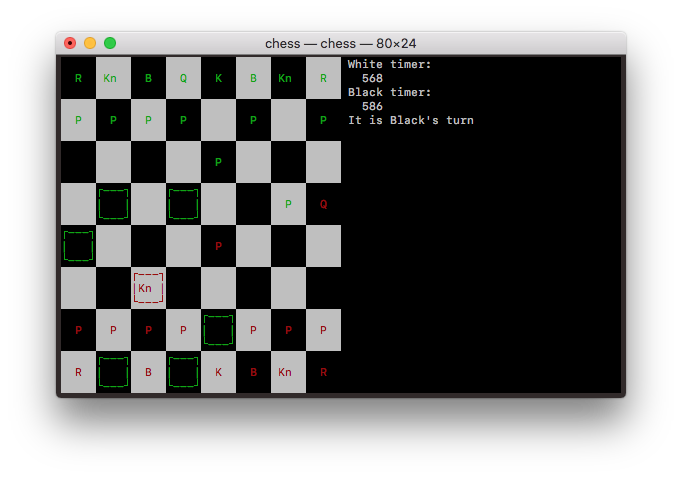

> As you complete each section you **must** remove the prompt text.
> Every *turnin* of this project includes points for formatting of
> this README so keep it clean and keep it up to date. Prompt text is
> any lines beginning with "\<" Replace anything between \<...\> with
> your project specifics and remove angle brackets. For example, you
> need to name your project and replace the header right below this
> line with that title (no angle brackets).
# Chess
 
Authors: \<[Christopher Luu](https://github.com/christopherluu-dev)\>
\<[Mark Vincent](https://github.com/MarkV2323)\> \<[Zachary
Napier](https://github.cm/Znapi)\>
 
> You will be forming a group of **THREE** students and work on an
> interesting project that you will propose yourself (in this
> `README.md` document). You can pick any project that you'd like, but
> it needs ot implement three design patterns. Each of the members in
> a group is expected to work on at least one design pattern and its
> test cases. You can, of course, help each other, but it needs to be
> clear who will be responsible for which pattern and for which
> general project features.
 
> ## Expectations
> * Incorporate **three** distinct design patterns, *two* of the
>   design patterns need to be taught in this course:
>   * Composite, Strategy, Abstract Factory, Visitor
> * All three design patterns need to be linked together (it can't be
>   three distinct projects)
> * Your project should be implemented in C/C++. If you wish to choose
>   anoher programming language (e.g. Java, Python), please discuss
>   with your lab TA to obtain permission.
> * You can incorporate additional technologies/tools but they must be
>   approved (in writing) by the instructor or the TA.
> * Each member of the group **must** be committing code regularly and
>   make sure their code is correctly attributed to them. We will be
>   checking attributions to determine if there was equal contribution
>   to the project.

## Project Description
> Your project description should summarize the project you are
> proposing. Be sure to include
> * Why is it important or interesting to you?
> * What languages/tools/technologies do you plan to use? (This list
>   may change over the course of the project)
>   * [toolname](link) - Short description
> * What will be the input/output of your project?
> * What are the three design patterns you will be using. For each
>   design pattern you must:
>   * Explain in 3 - 5 sentences why you picked this pattern and what
>     feature you will implement with it
> * This description should be in enough detail that the TA/instructor
>   can determine the complexity of the project and if it is
>   sufficient for the team members to complete in the time allotted.

### Why is it important or interesting to you?

This project (Chess) is important to us because this allows us to use
different design patterns and chess solving algorithms that we had
never worked with over the course of developing this project.

### What languages/tools/technologies do you plan to use? (This list may change over the course of the project)

* C++
* [NCurses](https://tldp.org/HOWTO/NCURSES-Programming-HOWTO/) - Will
  be used for visual display of chess game.

### What will be the input/output of your project?

The input of the project will be what piece the user would want to
move and different commands like move or view that shows specific
moves for that chess piece. The output would be the chess board with
all the pieces and the specified output when you moved a piece or you
want to view specific locations that a piece can move.

### Planned designed patterns to be used in the project

* Our first design pattern we plan to use will be the Command pattern.
  We picked this pattern because we want to be able to log moves in a
  ordered list called history. The benefits of having a history of
  moves is that it will simplify the saving and loading process of
  games.

* Our second design pattern we plan to use will be the Strategy
  pattern. We decided to go with the Strategy pattern because it gives
  us a lot of flexibility in implementing our saving and loading
  algorithims, specifically for different file formats. We plan to
  have strategies involving CSV and JSON based files.

* Our third design pattern we plan to use will be the Singleton
  pattern. There are a few objects that only need to have one
  instance, and for which having a single global access point will
  produce cleaner code rather than passing them around as parameters.
  For example, the chessboard will need to be used by numerous
  components: drawing, game logic, and the AI. A move timer would also
  be accessed by both drawing code and game logic. Both of these
  objects only need to have a single instance, since you only need one
  timer and one board per chess game.

> ## Phase II
> In addition to completing the "Class Diagram" section below, you
> will need to
> * Set up your GitHub project board as a Kanban board for the
>   project. It should have columns that map roughly to
>   * Backlog, TODO, In progress, In testing, Done
>   * You can change these or add more if you'd like, but we should be
>     able to identify at least these.
> * There is no requirement for automation in the project board but
>   feel free to explore those options.
> * Create an "Epic" (note) for each feature and each design pattern
>   and assign them to the appropriate team member. Place these in the
>   `Backlog` column
> * Complete your first *sprint planning* meeting to plan out the next
>   7 days of work.
>   * Create smaller development tasks as issues and assign them to
>     team members. Place these in the `Backlog` column.
>   * These cards should represent roughly 7 days worth of development
>     time for your team, taking you until your first meeting with the
>     TA

## Class Diagram 


Patterns Used:

* _Strategy_ - SaveStrategy - Will allow us to easily switch between
  different saving strategys, we plan to have one for both CSV and
  JSON formats.

* _Command_ - Command - A way to standardize the moving of pieces,
  which will make saving and loading games easier as a result.

* _Singleton_ - Chessboard - The chessboard will hold pretty much all
  of the data associated with the chess game, and as such will need to
  be accessed from other objects, hence making it based off of the
  Singleton pattern.
 
General Description:

The chessboard will have most of the data of the program, containing
the players invovled, a 2D array of Chess Pieces, a history of
commands (moves) executed, and some varibles to provide highlighting
of selected pieces, and possible spots to move to. We also want to
have turn timers for the players, and a object to store coordinates.

> ## Phase III
> You will need to schedule a check-in with the TA (during lab hours
> or office hours). Your entire team must be present.
> * Before the meeting you should perform a sprint plan like you did
>   in Phase II
> * In the meeting with your TA you will discuss:
>   - How effective your last sprint was (each member should talk
>     about what they did)
>   - Any tasks that did not get completed last sprint, and how you
>     took them into consideration for this sprint
>   - Any bugs you've identified and created issues for during the
>     sprint. Do you plan on fixing them in the next sprint or are
>     they lower priority?
>   - What tasks you are planning for this next sprint.

> ## Final deliverable
> All group members will give a demo to the TA during lab time. The TA
> will check the demo and the project GitHub repository and ask a few
> questions to all the team members. Before the demo, you should do
> the following:
> * Complete the sections below (i.e. Screenshots, Installation/Usage,
>   Testing)
> * Plan one more sprint (that you will not necessarily complete
>   before the end of the quarter). Your In-progress and In-testing
>   columns should be empty (you are not doing more work currently)
>   but your TODO column should have a full sprint plan in it as you
>   have done before. This should include any known bugs (there should
>   be some) or new features you would like to add. These should
>   appear as issues/cards on your Kanban board.

## Screenshots



## Installation/Usage

Requires NCurses (already on virtually any linux or macOS).

Installation:

```
cmake .
make chess
```

Usage:

`./chess`

Controls in game:

Key | Action
:-: | :-
arrow keys | Move the red cursor.
`x` | Select the piece under the cursor, or when a piece is selected, selects the square to move it to.
`s` | Save the current game.
`Q` | Exit the game.

Controls when promoting pawn:

Key | Upgrades to:
:-: | :-
`q` | Queen
`r` | Rook
`k` | Knight
`b` | Bishop

## Testing

The code is tested and validated using the googletest framework and a
small set of "visual tests" for inspecting the NCurses output of
graphical functions.

To build all tests, just run `make all`. The various tests are:

Name | Function
:-: | :--
`test` | Almost 90 unit tests
`visual_test` | Tests all the combinations of ways the visual state of the chessboard can change
`timer_visual_test` | Tests that the text information displayed to the right of the chessboard is updated and erased properly
`pawn_visual_test` | integration test of visuals and pieces
`human_visual_tester` | Simple test of controls


